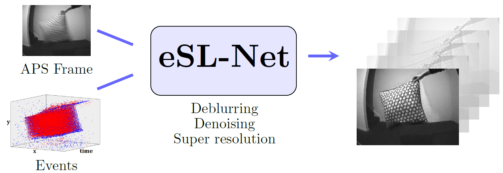
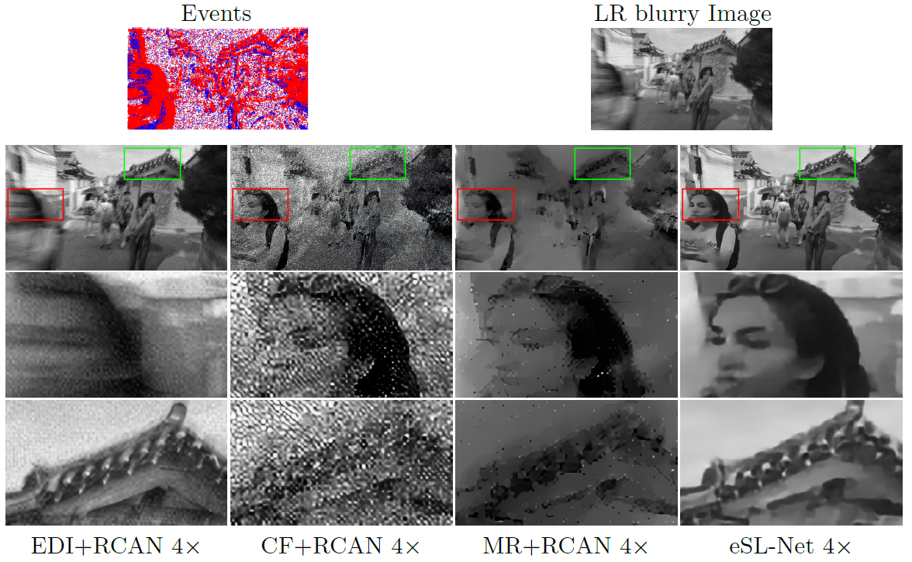
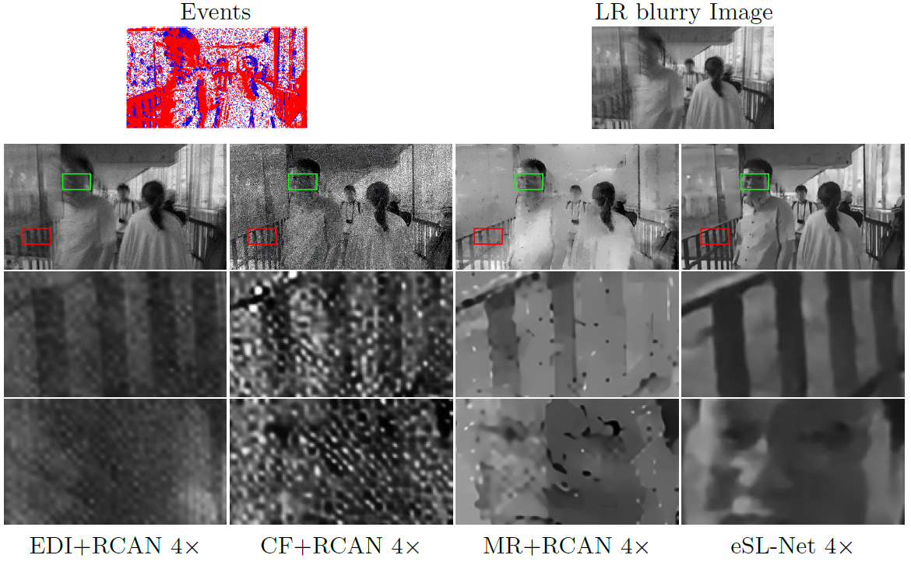
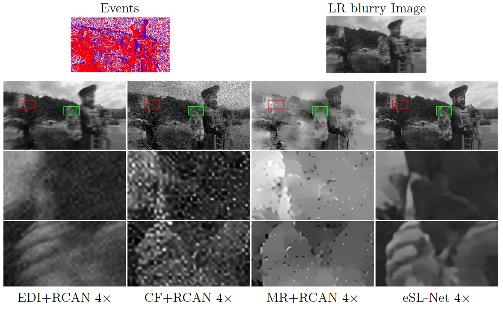
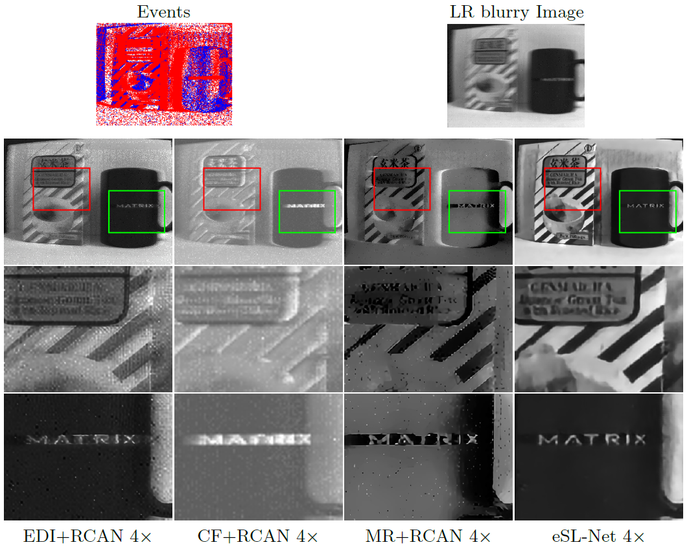
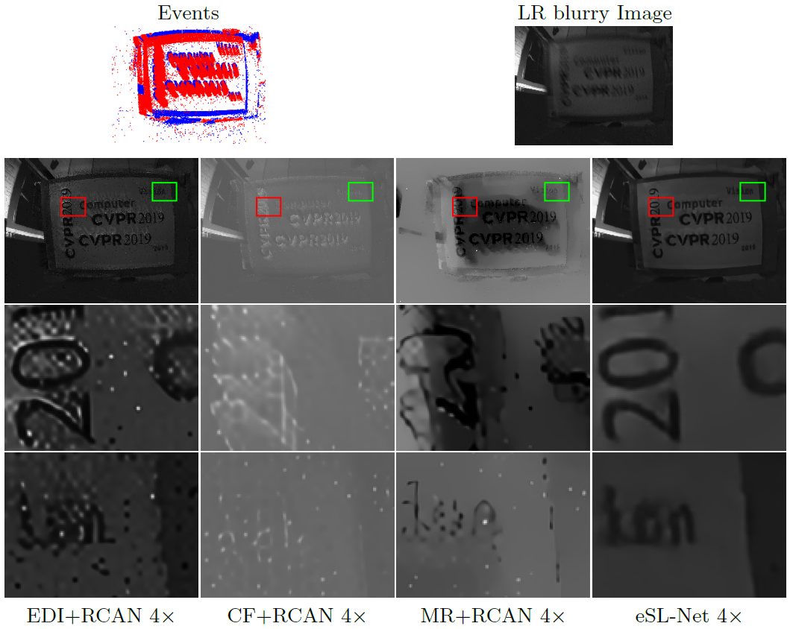
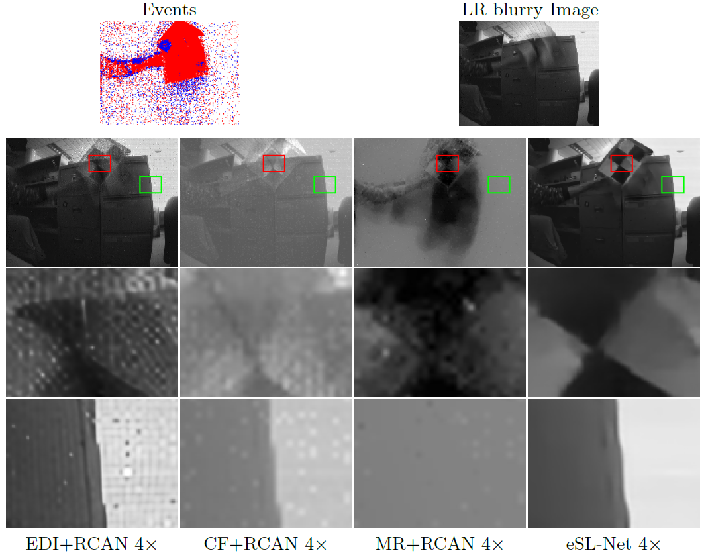

# eSL-Net

    
   

    
Figure 1. Our eSL-Net reconstructs high-resolution, sharp and clear intensity images for event cameras by APS frames and the corresponding event sequences.

## Contents

* [Introduction](#introduction)

* [Results](#results)
  * [Comparisons of Reconstruction on the synthetic dataset](#synthetic-dataset)
  * [Comparisons of Reconstruction on the real dataset](#real-dataset)
  * [High frame-rate Reconstruction ](#High-frame-rate)

## Introduction

With extremely high temporal resolution, event cameras have a large potential for robotics and computer vision. However, the recovering of high-quality images from event cameras is a very challenge problem, where the following issues should be addressed simultaneously.

* **Low frame-rate and blurry intensity images:** The APS (Active Pixel Sensor) frames are with relatively low frame-rate. And the motion blur is inevitable when recording highly dynamic scenes.

* **High level and mixed noises:** The thermal effects or unstable light environment can produce a huge amount of noisy events. Together with the noises from APS frames, the reconstruction of intensity image would fall into a mixed noises problem.
* **Low spatial-resolution:**  The leading commercial event cameras are typically with very low spatial-resolution. And there is a balance between the spatial-resolution and the latency

In our paper,  we propose an explainable network, an **e**vent-enhanced **S**parse **L**earning **Net**work (**eSL-Net**),  to **recover the high-quality images from event cameras**. Since events depict brightness changes, with the enhanced degeneration model by the events, the clear and sharp high-resolution latent images can be recovered from the noisy, blurry and low-resolution intensity observations. Exploiting the framework of sparse learning, the events and the low-resolution intensity observations can be jointly considered. Furthermore, without additional training process, the proposed eSL-Net can be **easily extended to generate continuous frames with frame-rate as high as the events**.

    
   

    
Figure 2. Architecture of the proposed eSL-Net.

## Results of Reconstruction

### Qualitative Comparisons of Reconstruction on the synthetic dataset

    
   
 

       
 Qualitative comparison of eSL-Net to EDI, CF and MR with SR method on the synthetic dataset.

| Methods  | EDI+RCAN 4x | CF+RCAN 4x | MR+RCAN 4x | eSL-Net 4x |
| :------: | :---------: | :--------: | :--------: | :--------: |
| PSNR(dB) |    12.88    |   12.89    |   12.89    | **25.41**  |
|   SSIM   |   0.4647    |   0.4638   |   0.4643   | **0.6727** |

       
 Quantitative comparison of our outputs to EDI, CF and MR with SR method on the synthetic dataset.

### Qualitative Comparisons of Reconstruction on the real dataset 

    
   
 

       
 Qualitative comparison of eSL-Net to EDI, CF and MR with SR method on the real dataset.

| real data/BRISQUE | EDI+RCAN 4x | CF+RCAN 4x | MR+RCAN 4x | eSL-Net 4x  |
| :---------------: | :---------: | :--------: | :--------: | :---------: |
|   camerashake1    |   55.8542   |  109.122   |  83.9851   | **55.6984** |
|    indoordrop     |   64.1578   |  65.8033   |  80.7871   | **62.5109** |

       
 Quantitative comparison of eSL-Net to EDI, CF and MR with SR method on the real dataset by BRISQUE measure, where lower values indicate higher quality.

### High frame-rate Reconstruction

In the following videos, The left side is the original APS frame by bicubic upsampling for 4 times, and the right side are the high frame rate, high resolution reconstructed results of eSL-Net.

**Event Camera——DAVIS240：**

    

    

**Event Camera——DAVIS346：**

     

